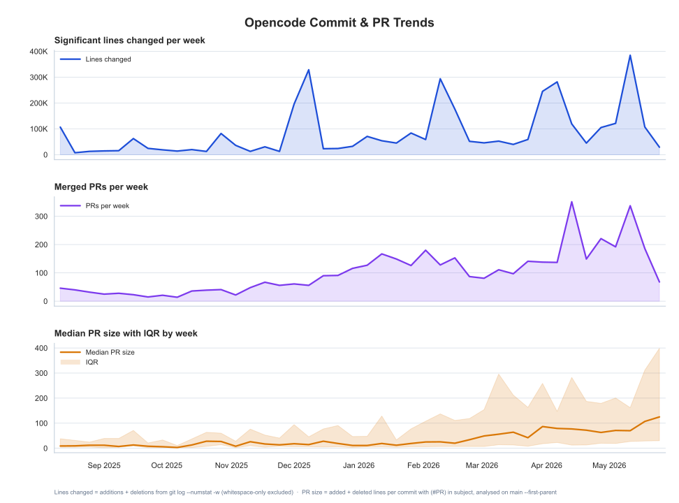
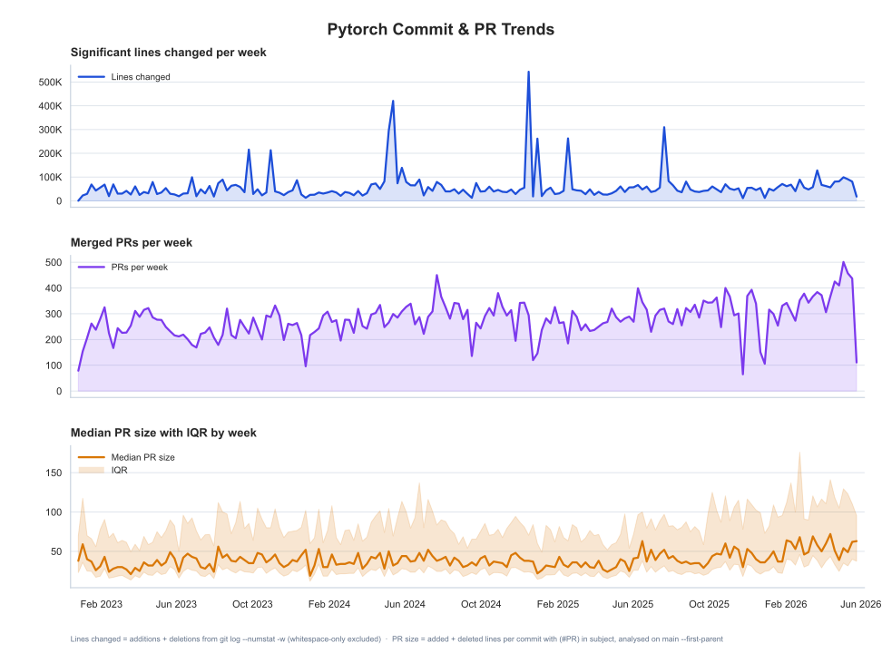

# Commit & PR Trend Analysis

A `uv`-managed Python project that renders a 3-panel weekly trend chart (lines changed, PRs per week, median PR size with IQR) from any git repository using seaborn and matplotlib.

The repo includes git submodules under `repos/` for ready-to-analyze data:

- [`openai/codex`](https://github.com/openai/codex) — AI coding agent
- [`microsoft/vscode`](https://github.com/microsoft/vscode) — Code editor
- [`anomalyco/opencode`](https://github.com/anomalyco/opencode) — CLI coding agent
- [`pytorch/pytorch`](https://github.com/pytorch/pytorch) — Deep learning framework

## What it measures

- **Commits & churn**: count of commits and significant lines changed (additions + deletions from `git log --numstat -w`, which ignores whitespace-only changes).
- **PR metrics** (estimated from git history, not the GitHub API): the script analyzes `main --first-parent` and treats commits whose subject contains a PR number like `(#12345)` as merged PRs. PR size is the added + deleted lines from `git log --numstat -w` for that commit.

This heuristic works well for repos that use squash merges; it will undercount or misclassify PRs under other merge styles.

## Run it

```bash
# Analyze the codex repo (default)
uv run git-weekly-trends

# Analyze another repo
uv run git-weekly-trends --repo repos/vscode --repo-label vscode --rev-spec "main --after=2023-01-01"
```

This writes a 3-panel chart SVG and a combined CSV (commit + PR data) that can be reused to regenerate the chart without re-scanning git history. Redraw from a saved CSV:

```bash
uv run git-weekly-trends \
  --main-chart-only \
  --metrics-csv-input output/codex_weekly_report_data.csv
```

## Codex — openai/codex

Event markers: GPT-5.2-Codex (Dec 2025), Codex app + GPT-5.3-Codex (Feb 2026).


### Notes on the data

Nine weeks exceeded 500,000 significant lines changed. Most of these spikes are from vendored/generated code churn or large-scale refactors, not from a proportional increase in hand-written engineering work.

| Week | Lines | Dominant change | Share |
|---|---|---|---|
| 2026-01-26 | 1,126,159 | Vendored protocol schema fixtures (80% `.json`) | Top 5 commits: 36% |
| 2026-02-16 | 597,938 | Removing generated v1 JSON schema codegen | Top 5 commits: 38% |
| 2026-03-09 | 935,749 | Moving TUI onto app-server + relocating unit tests (`.rs`) | Top 5 commits: 44% |
| 2026-03-16 | 600,456 | Extracting capabilities, sandbox, and orchestrator crates | Distributed |
| 2026-03-23 | 850,211 | Unifying TUI on app-server, deleting legacy TUI (145K lines removed) | Top 5 commits: 51% |
| 2026-04-20 | 962,434 | OAuth refactor, rollout trace crate, feature flag removals | Distributed (8%) |
| 2026-04-27 | 606,286 | App-server request-processor split, proto changes | Distributed |
| 2026-05-11 | 805,254 | TUI module splits, diagnostics, permissions refactor | Distributed (6%) |
| 2026-05-25 | 1,246,274 | Swapping vendored SQLite amalgamation (84% `.c`) | 2 commits: 93% |

**Vendored code** (Jan 26, Feb 16, May 25) — Generated protobuf schema files, vendored C dependencies, and codegen outputs produce large line counts from simple add/remove operations. The May 25 spike is two commits: one deleting the old SQLite amalgamation (582K lines) and one adding the fixed version (582K lines).

**Large refactors** (Mar 9, Mar 23) — The TUI was migrated onto an app-server architecture. In Mar 23 alone, 145K lines of legacy TUI code were deleted. These are true engineering work but concentrated deletions rather than sustained output.

**High-activity weeks** (Mar 16, Apr 20, Apr 27, May 11) — Top commits account for only 6–14% of total lines, meaning the churn was spread across many smaller changes typical of a busy engineering team.

## VS Code — microsoft/vscode

Analysis covers `main` from 2023 onwards (53,932 commits, 185 weeks).


### Notes on the data

Weekly PRs rose from 80–200 to sustained 200–377 from Jan 2026 onward, coinciding with the v1.109 release that transformed VS Code into a multi-agent platform (agent sessions, Claude + Codex support, MCP Apps, subagents).

| Week | Lines | Dominant change | Share |
|---|---|---|---|
| 2025-06-23 | 937,622 | "Hello Copilot" — large initial Copilot code check-in (`.ts`, `.json`) | 1 commit: 96% |
| 2025-10-20 | 161,116 | "Hello Copilot (#1493)" — Copilot deep integration landing | 1 commit: 39% |
| 2024-04-15 | 233,462 | Merge commits inflating counts (merge of `chat-agent-hover` branch) | Top 3 commits: 95% |

The PR detection heuristic (`#12345` in subject) may undercount if MS uses a different merge style where PR numbers don't always appear in first-parent subjects.

## OpenCode — anomalyco/opencode

Analysis covers `--all` from inception (42 weeks, 11,445 commits). A younger project (Aug 2025–present) with rapid growth from a small core team.



### Notes on the data

| Week | Lines | Dominant change | Share |
|---|---|---|---|
| 2026-05-11 | 384,840 | Pricing schema update + generated model snapshots | Top 3 commits: 76% |
| 2025-12-08 | 328,725 | Distributed churn (top 3 only 5%) — normal high activity | Distributed |
| 2026-02-09 | 293,853 | i18n documentation translations (192K lines) | Top 3 commits: 77% |
| 2026-04-06 | 281,748 | Generated code swaps + gitignore cleanup | Top 3 commits: 69% |

The same patterns appear: generated code and model snapshots dominate the line-change spikes, while most engineering work is distributed across many small PRs. PR size grew steadily from a median of ~10 lines in early months to ~70 lines by May 2026, reflecting growing feature complexity.

## PyTorch — pytorch/pytorch

Analysis covers `main` from 2023 onwards (49,841 commits, 179 weeks). A mature project with steady output (~200–500 PRs/week) and near-perfect PR detection (every commit has a `(#PR)` in its subject).



### Notes on the data

Unlike codex or vscode, pytorch shows no dramatic inflection points — activity grew gradually from ~250 PRs/week in 2023 to ~400 PRs/week by 2026.

| Week | Lines | Dominant change | Share |
|---|---|---|---|
| 2024-12-16 | 543,311 | ROCm CK Flash Attention Backend — new backend + revert | 2 commits: 93% |
| 2024-05-13 | 422,480 | Removing Caffe2 python code (legacy framework remnants) | 3 commits: 86% |
| 2024-05-06 | 295,537 | Removing unused Caffe2 subdirs (251K lines deleted) | 1 commit: 85% |
| 2025-07-21 | 309,724 | Removing tensorexpr tests + revert | 3 commits: 36% |

The dominant pattern is **legacy code deletion** — Caffe2 (pytorch's predecessor) code cleanup in mid-2024 and tensorexpr experiment removal in 2025. These are large one-off deletions rather than sustained output.

## Useful variations

Analyze only the main branch:

```bash
uv run git-weekly-trends --rev-spec main
```

Analyze the first-parent history of main:

```bash
uv run git-weekly-trends --rev-spec "main --first-parent"
```

The legacy wrapper still works if you want a direct script path:

```bash
uv run python scripts/analyze_repo_history.py
```
